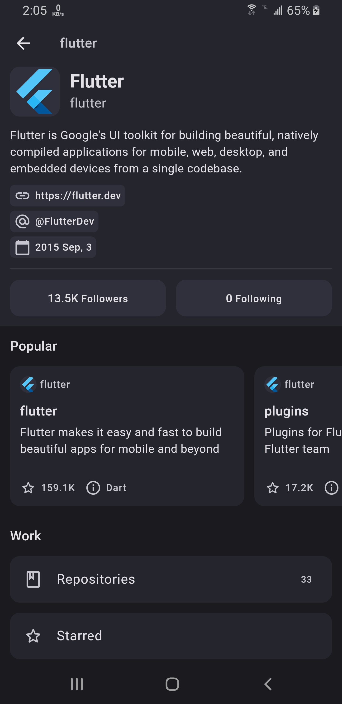
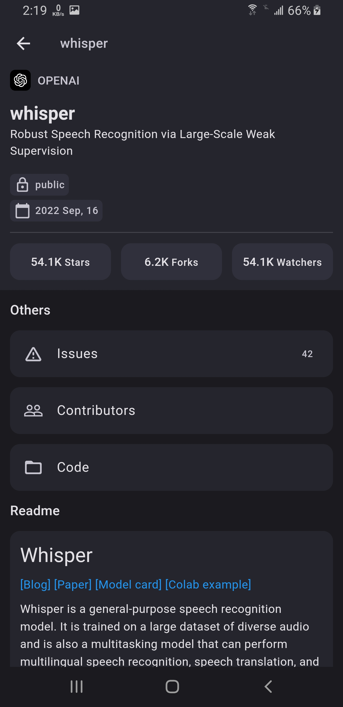
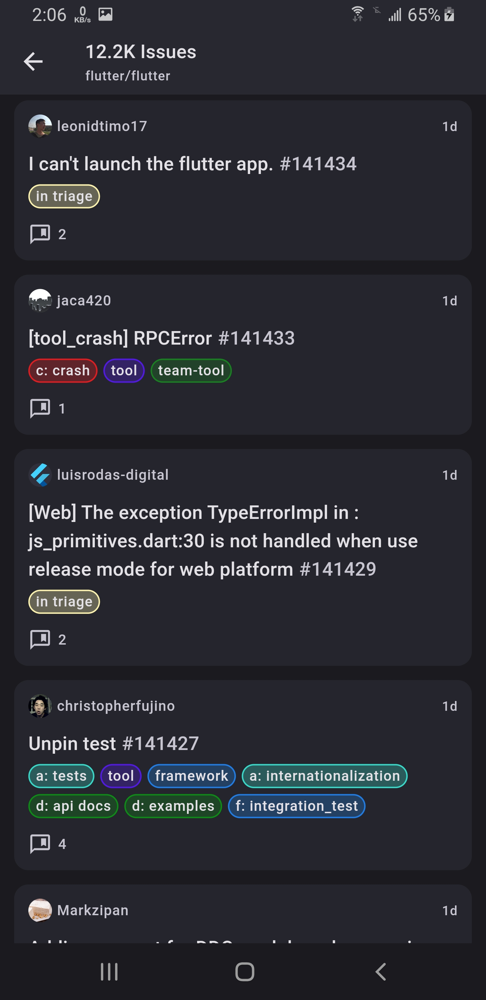
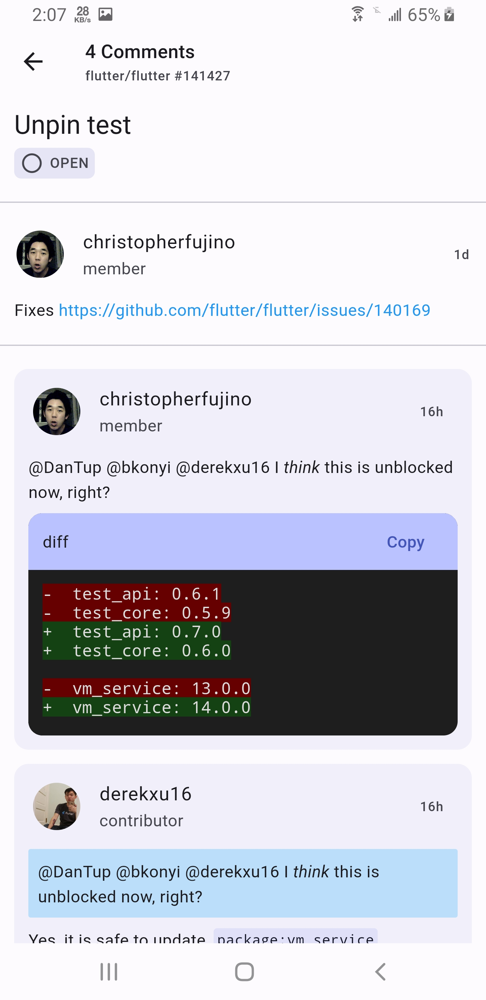
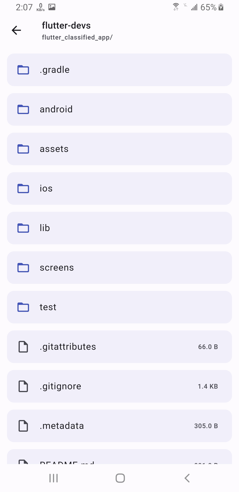
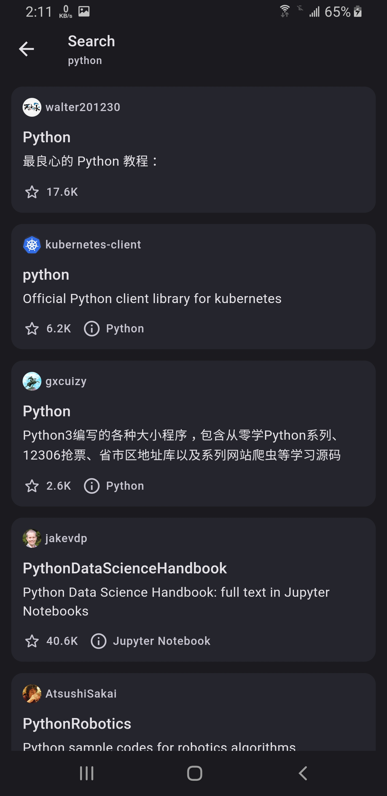
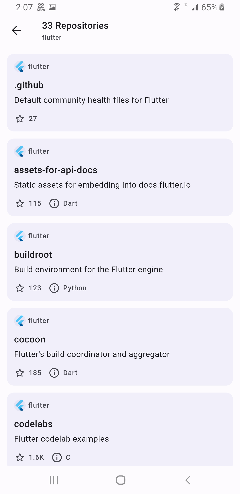
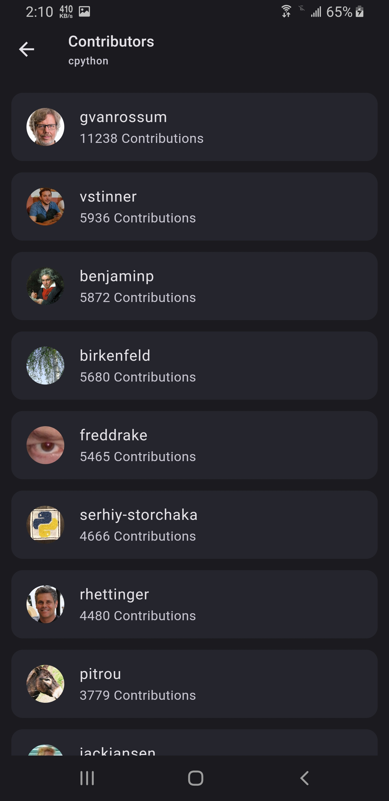

# Flutter GitHub Clone
A Flutter-based GitHub clone app, designed with clean architecture principles. This app features a swift and responsive UI, providing access to some of GitHub functionalities.

## App Screenshots

|   |   |
|---|---|
|   |   |
|   |   |
|   |   |


## Key Features
- **Clean Architecture:** Ensures scalable, maintainable, and testable code.
- **Efficient UI:** Fast and user-friendly interface.
- **Comprehensive GitHub Access:** Utilize a wide range of GitHub features directly from the app.
- **GitHub Functionalities Implemented:**
  - User Profile
  - Followers & Following
  - Stars & Forks
  - Repositories
  - Issues & Comments
  - Search (Issues, Repositories, Users)

## Packages
This app integrates a variety of packages to enhance functionality:

- **url_launcher:** Manages opening of web links in Flutter.
- **github_sign_in_plus:** Facilitates signing in with GitHub credentials.
- **dio:** Handles HTTP requests efficiently.
- **shared_preferences:** Stores app local values for quick retrieval.
- **flutter_bloc:** Implements state management for robust app behavior.
- **get_it:** Provides dependency injection for better modularity.
- **go_router:** Manages app routing and navigation.
- **equatable:** Simplifies the comparison of model objects.
- **dartz:** Offers deep Dart functionalities, including the `Either` type.
- **cached_network_image:** Efficiently caches network images for faster loading.
- **intl:** Formats dates and times for internationalization support.
- **skeletonizer:** Creates a shimmer loading effect for a better UX.
- **dio_cache_interceptor:** Adds caching capabilities to Dio for improved performance.
- **dio_cache_interceptor_hive_store:** Implements a Hive-based cache manager for Dio.
- **path_provider:** Accesses system file paths.
- **flutter_highlighter:** Displays code in a syntax-highlighted format.
- **flutter_markdown:** Handles basic Markdown syntax. (Note: Inline HTML is not supported.)

## TODO
- [ ] Resolve debugging errors.
- [ ] Check for internet connectivity issues.
- [ ] Address markdown rendering errors.


## File Structure
<details>
  <summary>Click to expand</summary>

```
lib/
├── main.dart
└── src/
    ├── core/
    │   ├── api/
    │   │   └── api.dart
    │   ├── assets/
    │   │   └── images.dart
    │   ├── core.dart
    │   ├── dio_client/
    │   │   └── dio_client.dart
    │   ├── error/
    │   │   ├── exceptions.dart
    │   │   ├── failures.dart
    │   │   └── get_failure_message.dart
    │   ├── extensions/
    │   │   ├── context.dart
    │   │   ├── datetime.dart
    │   │   ├── extensions.dart
    │   │   ├── num.dart
    │   │   ├── shared_prefrences.dart
    │   │   └── string.dart
    │   ├── loginfo/
    │   │   └── loginfo.dart
    │   ├── router/
    │   │   └── router.dart
    │   ├── services/
    │   │   ├── features/
    │   │   │   ├── code.dart
    │   │   │   ├── features.dart
    │   │   │   ├── issues.dart
    │   │   │   ├── repos.dart
    │   │   │   ├── user_profile.dart
    │   │   │   └── users.dart
    │   │   └── services.dart
    │   ├── theme/
    │   │   └── theme.dart
    │   ├── typedefs.dart
    │   ├── usecases/
    │   │   └── usecase.dart
    │   └── widgets/
    │       ├── custom_image.dart
    │       ├── custom_sliver_appbar.dart
    │       ├── error_dialog.dart
    │       ├── markdown/
    │       │   ├── custom_code_block.dart
    │       │   ├── markdown_widget.dart
    │       │   └── non_cache_image.dart
    │       ├── page_message.dart
    │       ├── primary_container.dart
    │       ├── repository_item.dart
    │       ├── shimmer_skeletonizer.dart
    │       ├── system_area.dart
    │       ├── tile_button.dart
    │       └── widgets.dart
    ├── features/
    │   ├── auth/
    │   │   ├── auth.dart
    │   │   └── auth_page.dart
    │   ├── code/
    │   │   ├── code.dart
    │   │   ├── data/
    │   │   │   ├── data.dart
    │   │   │   ├── datasource/
    │   │   │   │   └── remote_code_datasource.dart
    │   │   │   ├── models/
    │   │   │   │   └── file_info_model.dart
    │   │   │   └── repository/
    │   │   │       └── code_repository_impl.dart
    │   │   ├── domain/
    │   │   │   ├── domain.dart
    │   │   │   ├── entities/
    │   │   │   │   └── file_info.dart
    │   │   │   ├── repository/
    │   │   │   │   └── code_repository.dart
    │   │   │   └── usecases/
    │   │   │       ├── get_code.dart
    │   │   │       └── get_files.dart
    │   │   └── presentation/
    │   │       ├── bloc/
    │   │       │   ├── code_bloc.dart
    │   │       │   ├── code_event.dart
    │   │       │   └── code_state.dart
    │   │       ├── pages/
    │   │       │   └── files_page.dart
    │   │       ├── presentation.dart
    │   │       └── widgets/
    │   │           ├── file_item.dart
    │   │           ├── readme_widget.dart
    │   │           └── widgets.dart
    │   ├── features.dart
    │   ├── issues/
    │   │   ├── data/
    │   │   │   ├── data.dart
    │   │   │   ├── datasource/
    │   │   │   │   └── remote_issues_datasource.dart
    │   │   │   ├── models/
    │   │   │   │   ├── comment_mode.dart
    │   │   │   │   ├── issue_model.dart
    │   │   │   │   └── label_model.dart
    │   │   │   └── repository/
    │   │   │       └── issues_repository_impl.dart
    │   │   ├── domain/
    │   │   │   ├── domain.dart
    │   │   │   ├── entities/
    │   │   │   │   ├── comment.dart
    │   │   │   │   ├── comments.dart
    │   │   │   │   ├── issue.dart
    │   │   │   │   ├── issues.dart
    │   │   │   │   └── label.dart
    │   │   │   ├── repository/
    │   │   │   │   └── issues_repository.dart
    │   │   │   └── usecases/
    │   │   │       ├── get_comments.dart
    │   │   │       ├── get_issues.dart
    │   │   │       ├── get_more_comments.dart
    │   │   │       └── get_more_issues.dart
    │   │   ├── issues.dart
    │   │   └── presentation/
    │   │       ├── blocs/
    │   │       │   ├── comments_bloc/
    │   │       │   │   ├── comments_bloc.dart
    │   │       │   │   ├── comments_event.dart
    │   │       │   │   └── comments_state.dart
    │   │       │   └── issues_bloc/
    │   │       │       ├── issues_bloc.dart
    │   │       │       ├── issues_event.dart
    │   │       │       └── issues_state.dart
    │   │       ├── pages/
    │   │       │   ├── comments_page.dart
    │   │       │   └── issues_page.dart
    │   │       ├── presentation.dart
    │   │       └── widgets/
    │   │           ├── comment_item.dart
    │   │           ├── comment_user_tile.dart
    │   │           ├── issues_item.dart
    │   │           ├── label_item.dart
    │   │           └── widgets.dart
    │   ├── repos/
    │   │   ├── data/
    │   │   │   ├── data.dart
    │   │   │   ├── datasource/
    │   │   │   │   └── remote_repos_datasource.dart
    │   │   │   ├── models/
    │   │   │   │   └── repo_info_model.dart
    │   │   │   └── repository/
    │   │   │       └── repos_repository_impl.dart
    │   │   ├── domain/
    │   │   │   ├── domain.dart
    │   │   │   ├── entities/
    │   │   │   │   ├── repo_info.dart
    │   │   │   │   └── repos.dart
    │   │   │   ├── repository/
    │   │   │   │   └── repos_repository.dart
    │   │   │   └── usecases/
    │   │   │       ├── get_more_repos.dart
    │   │   │       ├── get_popular_repos.dart
    │   │   │       └── get_repos.dart
    │   │   ├── presentation/
    │   │   │   ├── bloc/
    │   │   │   │   ├── repos_bloc.dart
    │   │   │   │   ├── repos_event.dart
    │   │   │   │   └── repos_state.dart
    │   │   │   ├── pages/
    │   │   │   │   └── repos_page.dart
    │   │   │   └── presentation.dart
    │   │   └── repos.dart
    │   ├── user_profile/
    │   │   ├── data/
    │   │   │   ├── data.dart
    │   │   │   ├── datasource/
    │   │   │   │   └── remote_user_profile_datasource.dart
    │   │   │   ├── models/
    │   │   │   │   └── profile_model.dart
    │   │   │   └── repository/
    │   │   │       └── user_profile_repository_impl.dart
    │   │   ├── domain/
    │   │   │   ├── domain.dart
    │   │   │   ├── entities/
    │   │   │   │   └── profile.dart
    │   │   │   ├── repository/
    │   │   │   │   └── user_profile_repository.dart
    │   │   │   └── usecases/
    │   │   │       └── get_user_profile.dart
    │   │   ├── presentation/
    │   │   │   ├── bloc/
    │   │   │   │   ├── user_profile_bloc.dart
    │   │   │   │   ├── user_profile_event.dart
    │   │   │   │   └── user_profile_state.dart
    │   │   │   ├── pages/
    │   │   │   │   ├── repository_page.dart
    │   │   │   │   └── user_profile.dart
    │   │   │   ├── presentation.dart
    │   │   │   └── widgets/
    │   │   │       ├── custom_search_bar.dart
    │   │   │       ├── follow_button.dart
    │   │   │       ├── profile_info.dart
    │   │   │       ├── profile_property.dart
    │   │   │       ├── repository_info.dart
    │   │   │       └── widgets.dart
    │   │   └── user_profile.dart
    │   └── users/
    │       ├── data/
    │       │   ├── data.dart
    │       │   ├── datasources/
    │       │   │   └── remote_follow_datasource.dart
    │       │   ├── models/
    │       │   │   ├── user_model.dart
    │       │   │   └── users_model.dart
    │       │   └── repository/
    │       │       └── users_repository_impl.dart
    │       ├── domain/
    │       │   ├── domain.dart
    │       │   ├── entities/
    │       │   │   ├── user.dart
    │       │   │   └── users.dart
    │       │   ├── repository/
    │       │   │   └── users_repository.dart
    │       │   └── usecases/
    │       │       ├── get_more_users.dart
    │       │       └── get_users.dart
    │       ├── presentation/
    │       │   ├── bloc/
    │       │   │   ├── users_bloc.dart
    │       │   │   ├── users_event.dart
    │       │   │   └── users_state.dart
    │       │   ├── pages/
    │       │   │   └── followers_page.dart
    │       │   ├── presentation.dart
    │       │   └── widgets/
    │       │       ├── follower_item.dart
    │       │       └── widgets.dart
    │       └── users.dart
    └── src.dart
```


</details>

